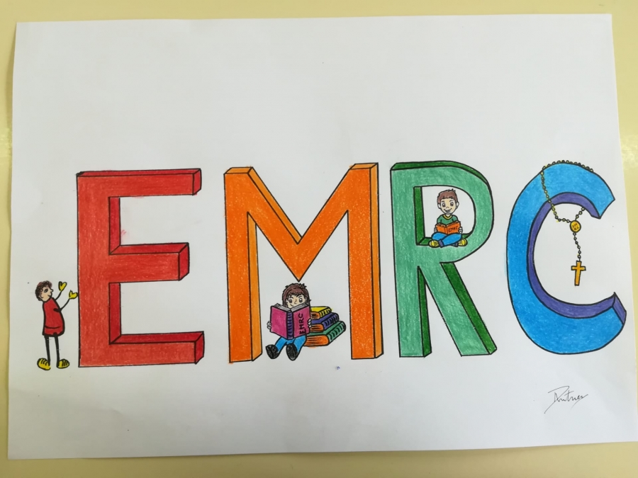

# Moral_Project
 Projeto de Moral 2022

No âmbito da disciplina de Moral 2022, decidimos aliar as nossas competências individuais e expor temas pertinentes aliando arte e tecnologia. 
Os links abaixo são a base dos nossos projetos.

Temas desenvolvidos:

1. <a href="https://mestrehq5.github.io/Moral_Project/Ecologia/ecologia.html"> Ecologia </a>
2. <a href="https://mestrehq5.github.io/Moral_Project/Adolescência/adolescencia.html"> Adolescência </a>
3. <a href="https://mestrehq5.github.io/Moral_Project/Projetos_Vida/projetos_vida.html"> Projetos de Vida </a>

Enjoy :P

